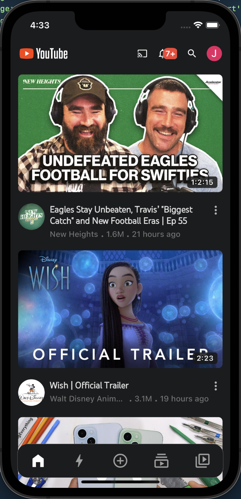
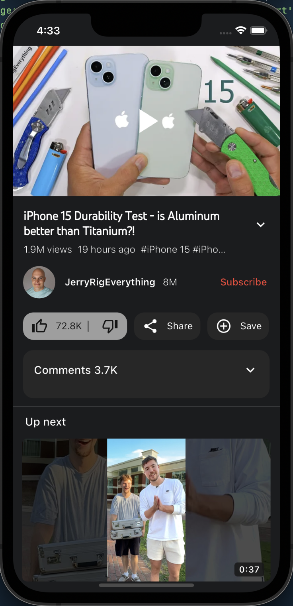
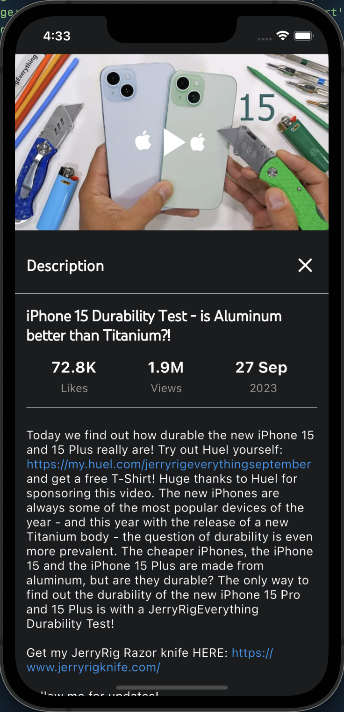
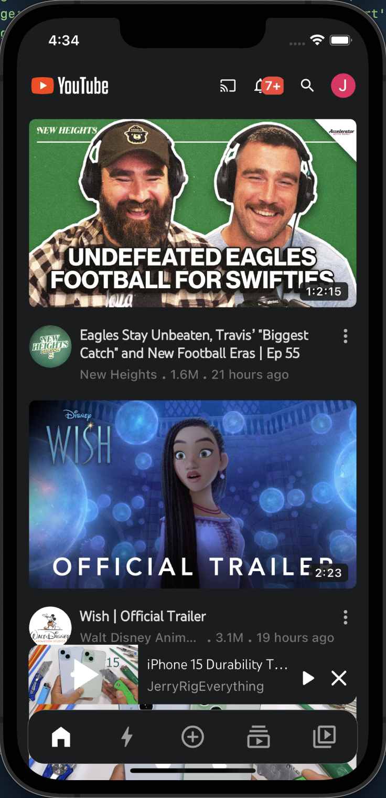

# yt_ui_clone

I created a Flutter app by cloning the YouTube homepage and video mini-player UI and used the YouTube Data API v3 to fetch video data.

# How to run

1. Get your Youtube Data API v3 Key [here](https://console.cloud.google.com/apis/dashboard)
2. Add a `.env` file at the root of the project and set an environment variable `API_KEY` which holds your Youtube Data API key
3. Run the following commands

```bash
flutter pub get

flutter pub run build_runner clean

flutter pub run build_runner build
#(Note: enter '1' in the prompt to delete previously generated codes).

flutter run
```

# Demo
https://github.com/Jayaprakash-dev/Youtube-UI-Clone-Flutter/assets/68953739/738b15bb-de23-4704-93eb-8233230ff9de

# Screenshots
<div style="display: flex; flex-direction: row; justify-content: space-around">
	<div>
		<p>Home page</p>
		
	</div>
	<div>
		<p>Youtube video player page</p>
		
	</div>
</div>

<div style="margin-top: 50px;display: flex; flex-direction: row; justify-content: space-around">
	<div>
		<p>Youtube video player page</p>
		
	</div>
	<div>
		<p>YT Miniplayer</p>
		
	</div>
</div>